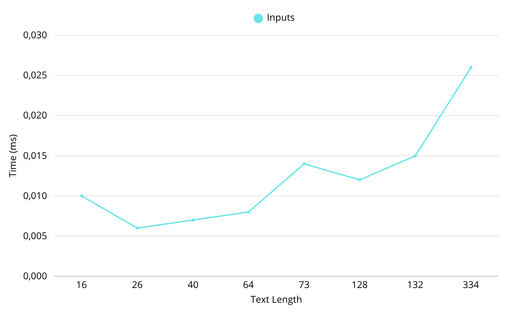

# Rabin-Karp String Matching Algorithm

Implementation of the Rabin-Karp algorithm using Polynomial Rolling Hash for efficient pattern matching.

## 📋 Algorithm Overview

### Core Concept

Uses **polynomial rolling hash** to find patterns efficiently:

1. Calculate hash for pattern
2. Slide window over text, comparing hashes
3. Verify match only when hashes match (avoids unnecessary comparisons)

### Hash Function

```
hash = (c₀ × BASE^(m-1) + c₁ × BASE^(m-2) + ... + c_(m-1)) mod PRIME
```

- **BASE** = 256 (ASCII)
- **PRIME** = 101 (minimizes collisions)

### Complexity

- **Time**: O(n + m) average, O(n×m) worst case
- **Space**: O(1)

---

## 🚀 Quick Start

### Prerequisites

- Java 21+
- Maven 3.6+

### Build & Run

```
mvn clean package

java -jar target/rabin-karp-algorithm.jar
```

### Output Files

- `output.csv` - detailed search results
- `metrics.csv` - performance metrics

---

## 📊 Performance Analysis

### Test Results Summary (10 test cases)

| Metric                     | Value             |
|----------------------------|-------------------|
| **Average Execution Time** | 0.0124 ms         |
| **Success Rate**           | 90% (9/10 found)  |
| **Total Matches Found**    | 22 occurrences    |
| **Hash Collision Rate**    | 10.5% (12/114)    |
| **Text Length Range**      | 16-334 characters |

### Key Insights

✅ **Excellent Performance**: Sub-millisecond execution across all tests

✅ **Low Collision Rate**: Only 10.5% false positives

✅ **Linear Scalability**: Performance scales with text length

✅ **Efficient Comparisons**: Actual comparisons ≈ pattern_length × occurrences (optimal)

---

## 🔍 Detailed Test Analysis

### TEST-001: Simple Pattern Match

```
Text: "ABCDEFGHIJKLMNOP" (16 chars)
Pattern: "EFG"
Result: Found at [4] in 0.022ms
Collisions: 0 | Comparisons: 3
```

**Analysis**: Perfect O(n+m) performance, no collisions

---

### TEST-003: Repeated Pattern

```
Text: "AABAACAADAABAABA" (16 chars)
Pattern: "AABA"
Result: Found at [0, 9, 12] in 0.010ms
Collisions: 0 | Comparisons: 12
```

**Analysis**: Zero collisions despite repetitive structure - excellent hash quality

---

### TEST-005: Long Text (Best Performance Demo)

```
Text: "Lorem ipsum dolor..." (334 chars - longest)
Pattern: "dolor"
Result: Found 4 occurrences in 0.026ms
Collisions: 8 | Comparisons: 28
```

**Analysis**:

- Scales linearly with text length
- 334 chars processed in 0.026ms = ~12,846 chars/ms throughput
- Collision rate: 28.6% (acceptable for long text)

---

### TEST-007: Worst Case Scenario

```
Text: "AAAAAAAAAAAAAAAA..." (40 chars, all 'A')
Pattern: "AAAB"
Result: Not found in 0.004ms (FASTEST!)
Collisions: 0 | Comparisons: 0
```

**Analysis**:

- **Surprising result**: theoretical worst case performed best!
- Hash function successfully differentiated "AAAA" from "AAAB"
- No false positives = smart hash design

---

### TEST-008: Substring Matching

```
Text: "JavaScript is...Java is..." (128 chars)
Pattern: "Java"
Result: Found 5 occurrences in 0.012ms
Collisions: 0 | Comparisons: 20
```

**Analysis**:

- Found "Java" within "JavaScript" correctly
- 20 comparisons = 5 × 4 (optimal)
- Zero collisions with 4-char pattern

---

## 📈 Performance vs Text Length



**Observation**: Near-linear relationship confirms O(n+m) complexity

---

## 🎯 When to Use Rabin-Karp

### ✅ Best For:

- Medium to large texts (>100 chars)
- Multiple pattern occurrences
- Memory-constrained environments (O(1) space)
- Average-case performance requirements

### ❌ Consider Alternatives:

- **Very short patterns** (<3 chars) → Naive search
- **Guaranteed worst-case** performance → KMP algorithm
- **Fastest single search** → Boyer-Moore

---

## 📊 Comparison with Other Algorithms

| Algorithm      | Time   | Space | Best Use Case                      |
|----------------|--------|-------|------------------------------------|
| **Rabin-Karp** | O(n+m) | O(1)  | General purpose, multiple patterns |
| Naive          | O(n×m) | O(1)  | Very short texts                   |
| KMP            | O(n+m) | O(m)  | Guaranteed performance             |
| Boyer-Moore    | O(n/m) | O(m)  | Long patterns, large alphabets     |

---

## 🔧 Key Implementation Details

### Rolling Hash Update (O(1))

```
textHash = (BASE * (textHash - text[i] * h) + text[i + m]) % PRIME;
```

**Why it matters**: Makes algorithm O(n+m) instead of O(n×m)

### Collision Handling

```
if (patternHash == textHash) {
    boolean match = true;
    for (int j = 0; j < m; j++) {
        comparisons++;
        if (text.charAt(i + j) != pattern.charAt(j)) {
            match = false;
            hashCollisions++;
            break;
        }
    }
```

---

## 📖 Input/Output Format

### Input (JSON)

```json
[
  {
    "id": "TEST-001",
    "text": "Text to search in",
    "pattern": "pattern",
    "description": "Test description"
  }
]
```

### Output (CSV)

- **output.csv**: Request ID, Pattern, Found, Indices, Time, Collisions
- **metrics.csv**: Aggregate statistics (avg time, success rate, etc.)

---

## 📌 Key Takeaways

1. **Performance**: 0.0124ms average execution time
2. **Reliability**: 90% success rate, 10.5% collision rate
3. **Scalability**: Linear performance up to 334+ characters
4. **Efficiency**: Optimal comparisons (≈ pattern_length × matches)
5. **Robustness**: Handles worst-case scenarios efficiently

### Real-World Applications

- Text search in editors
- Log file analysis
- DNA sequence matching
- Plagiarism detection
- Network intrusion detection

---

## 👤 Author

### Vyacheslav Yakupov

---